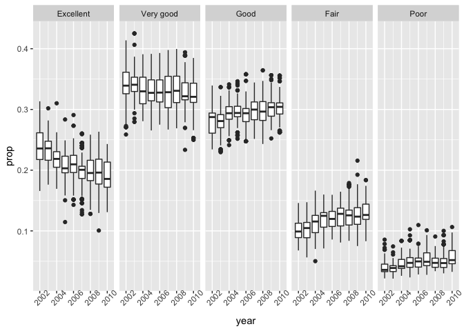

p8105\_hw3\_ja3314
================
Jaisal Amin
10/12/2018

Problem 1
---------

Reading and cleaning BRFSS data:

``` r
brfss_df = filter(brfss_smart2010, Topic == "Overall Health", !is.na(Response)) %>% 
  janitor::clean_names() %>% 
  mutate(response = factor(response, levels = c("Excellent", "Very good", "Good", "Fair", "Poor")))
```

States that were observed at 7 locations in 2002:

``` r
brfss_df %>% 
  filter(year == 2002) %>%
  distinct(locationdesc, .keep_all = TRUE) %>% 
  count(locationabbr) %>%
  filter(n == 7) %>% 
  pull(locationabbr) %>% 
  abbr2state()
```

    ## [1] "Connecticut"    "Florida"        "North Carolina"

Spaghetti plot of number of locations in each state in 2002-2010:

``` r
brfss_df %>%
  group_by(locationabbr, year) %>%
  distinct(locationdesc, .keep_all = TRUE) %>%
  summarize(n = n()) %>% 
  ggplot(aes(x = year, y = n, color = locationabbr)) +
           geom_line(size = 0.3)
```


Make a table showing, for the years 2002, 2006, and 2010, the mean and standard deviation of the proportion of “Excellent” responses across locations in NY State.

``` r
brfss_df %>%
  filter(year == 2002 | year == 2006 | year == 2010) %>% 
  filter(locationabbr == "NY") %>% 
  select(year, locationabbr, locationdesc, response, sample_size) %>% 
  group_by(locationdesc, year) %>% 
  mutate(sum = sum(sample_size)) %>%
  filter(response == "Excellent") %>%
  mutate(prop_excel = sample_size/sum) %>%
  group_by(year) %>% 
  summarize(mean(prop_excel), sd(prop_excel)) %>% 
  knitr::kable()
```

|  year|  mean(prop\_excel)|  sd(prop\_excel)|
|-----:|------------------:|----------------:|
|  2002|          0.2479209|        0.0398064|
|  2006|          0.2183477|        0.0386777|
|  2010|          0.2032255|        0.0459512|

For each year and state, compute the average proportion in each response category (taking the average across locations in a state). Make a five-panel plot that shows, for each response category separately, the distribution of these state-level averages over time.

``` r
brfss_df %>% 
  select(year, locationabbr, locationdesc, response, sample_size) %>%
  group_by(locationabbr, year) %>%
  mutate(sum_state = sum(sample_size)) %>% 
  group_by(response, locationabbr, year) %>% 
  mutate(sum_response = sum(sample_size)) %>% 
  mutate(prop = sum_response/sum_state) %>%
  select(year, locationabbr, prop) %>%
  ggplot(aes(x = year, y = prop)) +
  geom_point(alpha = 0.5) +
  facet_grid(~response)
```



Problem 2
---------

The `instacart` dataset is a tibble data frame with dimensions 1384617 rows and 15 columns. It contains information on specific products -- such as their names and what aisle they are located on -- as well as information about the individual orders themselves.

**How many aisles are there and which aisles are the most items ordered from?**

``` r
nrow(distinct(instacart, aisle_id))
```

    ## [1] 134

``` r
aisle_count = count(instacart, aisle_id)
aisle_count_name = count(instacart, aisle)
aisle_count[which.max(aisle_count$n), 1]
```

    ## # A tibble: 1 x 1
    ##   aisle_id
    ##      <int>
    ## 1       83

**Make a plot that shows the number of items ordered in each aisle. Order aisles sensibly, and organize your plot so others can read it.**

``` r
aisle_count %>% 
  ggplot(aes(x = aisle_id, y = n)) +
  geom_point()
```


``` r
aisle_count_name %>% 
  ggplot(aes(x = aisle, y = n)) +
  geom_point() +
  theme(axis.text.x = element_text(angle = 90, hjust = 1))
```


**Make a table showing the most popular item in each of the aisles “baking ingredients”, “dog food care”, and “packaged vegetables fruits”.**

``` r
instacart %>% 
  select(product_name, aisle) %>% 
  filter(aisle == "baking ingredients" | aisle == "dog food care" | aisle == "packaged vegetables fruits") %>%
  group_by(aisle) %>% 
  count(product_name) %>% 
  slice(which.max(n)) %>% 
  knitr::kable()
```

| aisle                      | product\_name                                 |     n|
|:---------------------------|:----------------------------------------------|-----:|
| baking ingredients         | Light Brown Sugar                             |   499|
| dog food care              | Snack Sticks Chicken & Rice Recipe Dog Treats |    30|
| packaged vegetables fruits | Organic Baby Spinach                          |  9784|

**Make a table showing the mean hour of the day at which Pink Lady Apples and Coffee Ice Cream are ordered on each day of the week; format this table for human readers (i.e. produce a 2 x 7 table).**

``` r
instacart %>% 
  filter(product_name == "Pink Lady Apples" | product_name == "Coffee Ice Cream") %>%
  select(product_name, order_dow, order_hour_of_day) %>% 
  group_by(product_name, order_dow) %>% 
  summarize(mean = mean(order_hour_of_day)) %>% 
  spread(key = order_dow, value = mean) %>%
  rename("Sunday" = "0", "Monday" = "1", "Tuesday" = "2", "Wednesday" = "3", "Thursday" = "4", "Friday" = "5", "Saturday" = "6") %>% 
    knitr::kable()
```

| product\_name    |    Sunday|    Monday|   Tuesday|  Wednesday|  Thursday|    Friday|  Saturday|
|:-----------------|---------:|---------:|---------:|----------:|---------:|---------:|---------:|
| Coffee Ice Cream |  13.77419|  14.31579|  15.38095|   15.31818|  15.21739|  12.26316|  13.83333|
| Pink Lady Apples |  13.44118|  11.36000|  11.70213|   14.25000|  11.55172|  12.78431|  11.93750|
